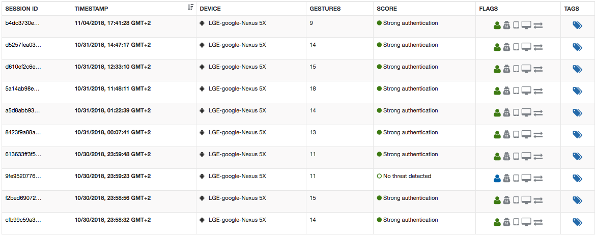
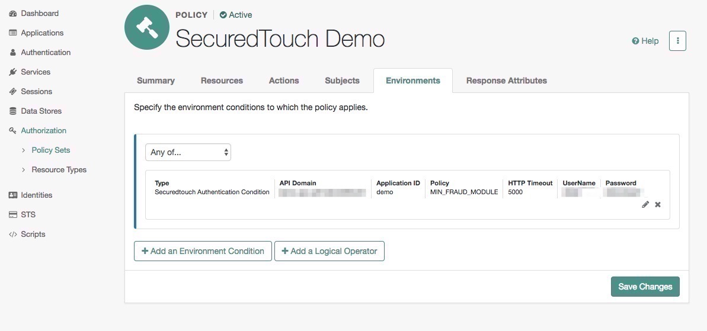

# SecuredTouch Introduction
SecuredTouch uses advanced Behavioral Biometrics technology and algorithms in order to enable Continuous and Passive Authentication of good users and Detect Fraudulent Sessions and activities in digital channels.

SecuredTouch supports web applications (desktopn and mobile) as well as native mobile applications (Android and iOS).

SecuredTouch in tegration invoves:

 * client SDK integration
 * backend API for quering SecuredTouch session Trust Score

When integrated via ForgeRock - you only need to integrate the client SDKs and ForgeRock will handle the backend side - calling SecuredTouch API and taking actions based on the Trust Score. For example - use SecuredTouch passive authentication as a step-up authentication and reduce friction on transaction

# Installation

Copy the .jar file from the ../target directory into the ../web-container/webapps/openam/WEB-INF/lib directory where AM is deployed.

Edit translation.json file - under ../web-container/webapps/openam/XUI/locales/en

Search for "conditionTypes" and add to it the following:

```json
"SecuredTouchCondition": {
                            "title": "Securedtouch Authentication Condition",
                            "props": {
                                "apiDomain": "API Domain",
                                "appId": "Application ID",
                                "policy": "Policy",
                                "timeout": "HTTP Timeout",
                                "appSessionId": "appSessionId",
                                "username" : "UserName",
                                "password" : "Password"
                            }
                        },
```

should looks like this after editing it

```json
"conditionTypes": {
                        "SecuredTouchCondition": {
                            "title": "Securedtouch Authentication Condition",
                            "props": {
                                "apiDomain": "API Domain",
                                "appId": "Application ID",
                                "policy": "Policy",
                                "timeout": "HTTP Timeout",
                                "appSessionId": "appSessionId",
                                "username" : "UserName",
                                "password" : "Password"
                            }
                        },
                        "AMIdentityMembership": {
                            "title": "Identity Membership",
                            "props": {
                                "amIdentityName": "AM Identity Name"
                            }
                        },
                        "AuthLevel": {
                            "title": "Authentication Level (greater than or equal to)",
                            "props": {
                                "authLevel": "Authentication Level"
                            }
                        },
                        "AuthScheme": {
                            "title": "Authentication by Module Instance",
                            "props": {
                                "authScheme": "Authentication Scheme",
                                "applicationIdleTimeout": "Application Idle Timeout Scheme",
                                "applicationName": "Application Name"
                            }
                        }
                        ....
}


```

Restart the web container, the new condition will appare under Authorization -> Policy Set -> Policy -> Environments -> SecuredTouchCondition.

In case SecuredTouchCondition should be added to existing policy, follow the following explanation on how to update existing policy with new condition:
https://backstage.forgerock.com/docs/am/6/authorization-guide/#add-custom-policy-impl-to-existing-apps

 
# SecuredTouch Configuration
If you don't already have a SecuredTouch account, please contact us at contact@securedtouch.com

Once you've integrated SecuredTouch SDK into the client application, you'll be able to see the sessions on SecuredTouch dashboard



Next you can integrate in order to integrate SecuredTouch with ForgeRock you'll need the following attributs from SecuredTouch:

 * api-domain : e.g. 'example.securedtouch.com'
 * app-id : e.g. 'example' (same as used with the client SDK)
 * policy : which SecuredTouch policy score should be used. e.g. 'auth-only-policy'
 * api-username : e.g. 'api-user'
 * api-password : e.g. 'api-pass'


# ForgeRock configuration 

1. Log into ForgeRock AM console
2. Go to Authorization -> Policy Set -> {policy} -> Environments -> Add environment condition -> select Securedtouch Authentication Condition

3. Fill the data as provided by SecuredTouch (API Domain, Application ID, Policy, username and password)
4. Save changes.


# Usage
After the user has been authenticated use SecuredTouch SDK to set its sessionId to match the one that ForgeRock will try to auth 
```java
SecuredTouchSDK.setSessionId(USER_SESSION_ID);
```